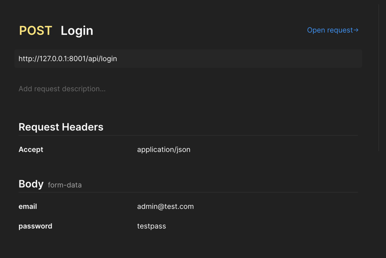
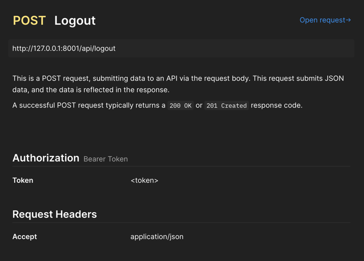
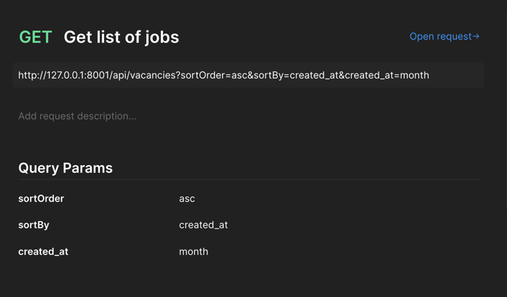
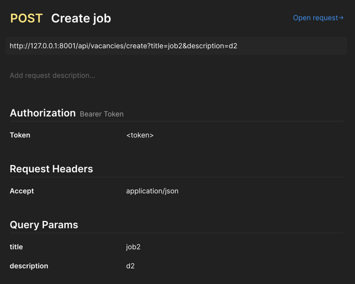
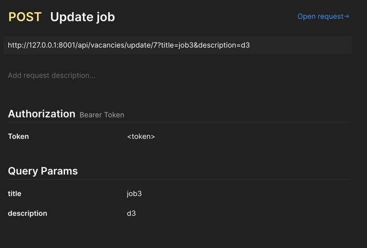
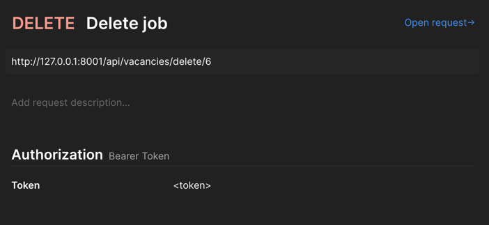
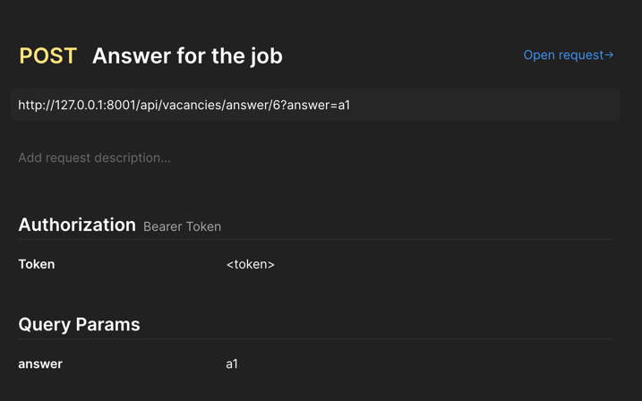
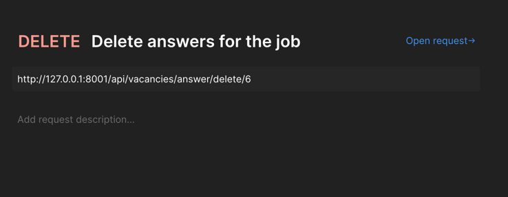

## Install project

- composer install
- change .env credentials to database
- php artisan migrate
- php artisan db:seed
- After that you have two users:
  - email: admin@test.com pass: testpass
  - email: test@test.com pass: testpass
- php artisan serve (Start the project)

## Routes

- POST /api/login - Login
- POST /api/logout - Logout (Only auth)
- GET /api/vacancies - Get list of jobs
- POST /api/vacancies/create = Create job (Only auth)
- POST /api/vacancies/update/{job_id} - Update job (Only auth)
- DELETE /api/vacancies/delete/{job_id} - Delete job (Only auth)
- POST /api/vacancies/answer/{job_id} - Answer to the job (Only auth)
- DELETE /api/vacancies/answer/delete/{job_id} - Delete all answers from the job (Only auth)

## Filters and Sorting in query GET /api/vacancies

Filters fields: title and created_at (day, week, month)
Sorting fields: created_at and answers_count

Example query: /api/vacancies?sortOrder=asc&sortBy=created_at&created_at=month

### Postman

